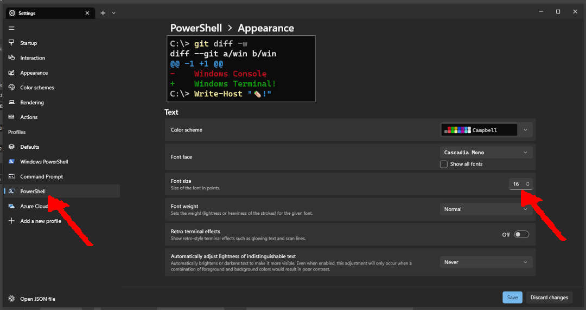
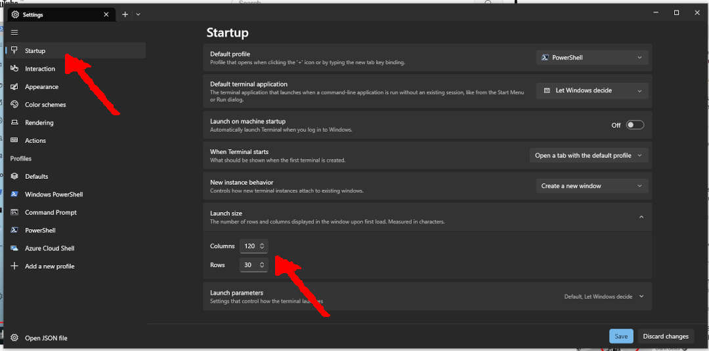

# Windows Powershell and Terminal


## Installing PowerShell Version 7


```
winget search Microsoft.PowerShell
```

```
winget install --id Microsoft.Powershell --source winget
```


## Installing Windows Terminal (Recommended Way)


## Installing Windows Terminal (Alternate Way)
```
winget search  "Windows Terminal"
```

```
winget install "windows terminal" --source "msstore"
```


## Setting PowerShell 7


## PowerShell Font Size





## PowerShell Screen Size





## WinGet Update and Upgrade


Upgrading from PowerShell version 7.3.4 to version 7.3.5.


```
winget update

winget upgrade --id Microsoft.Powershell --source winget
```


## Uninstall


```
winget uninstall --id Microsoft.Powershell
```

```
Path: docs/debian-guest/windows-powershell-terminal
```