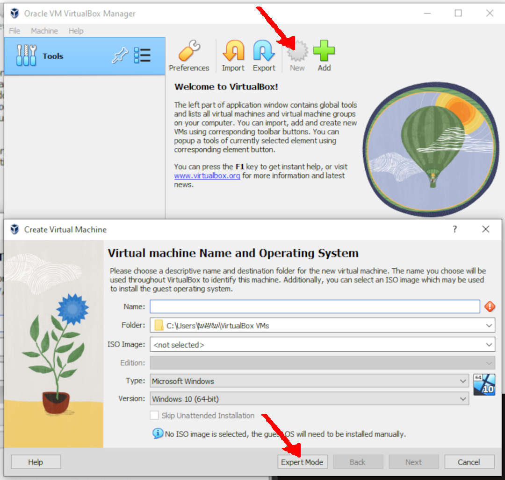
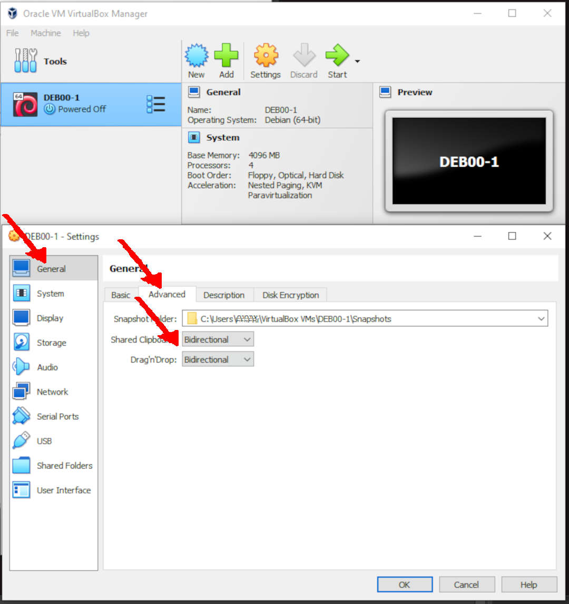
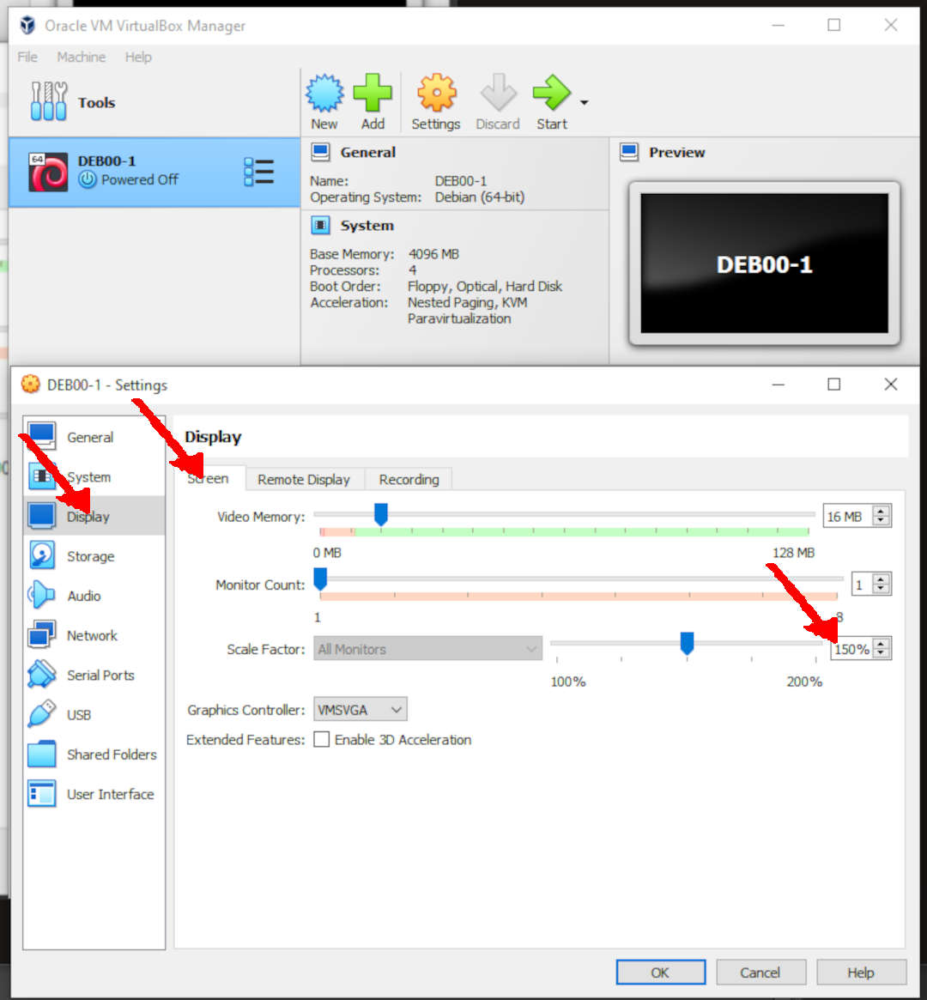
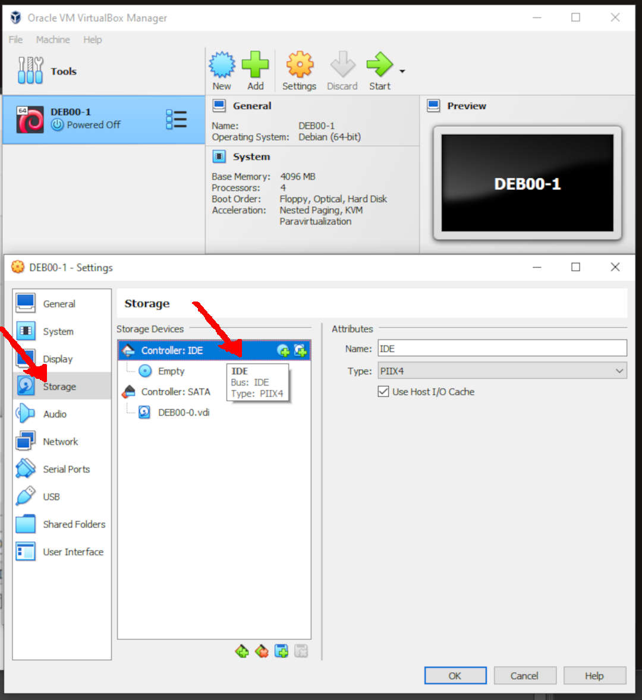
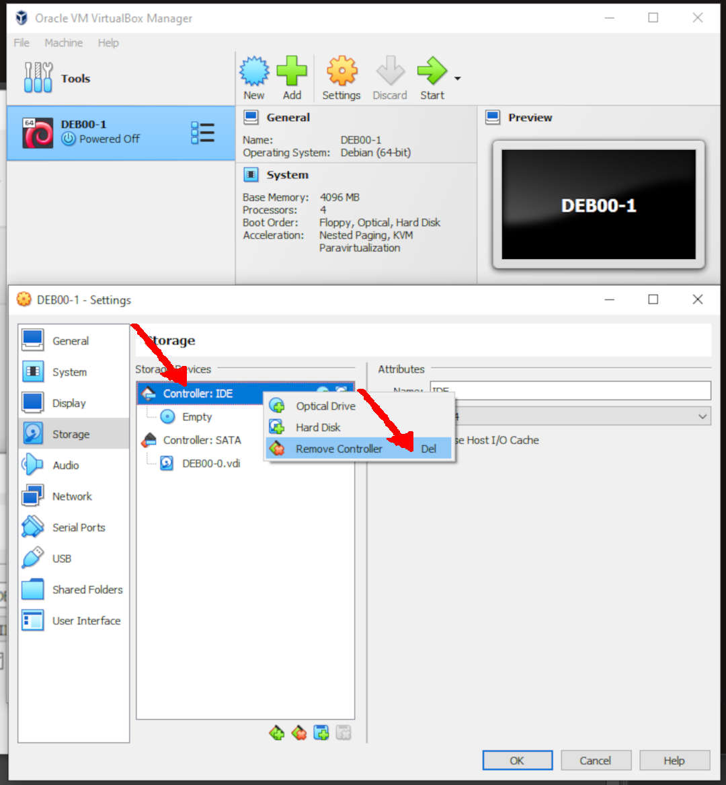
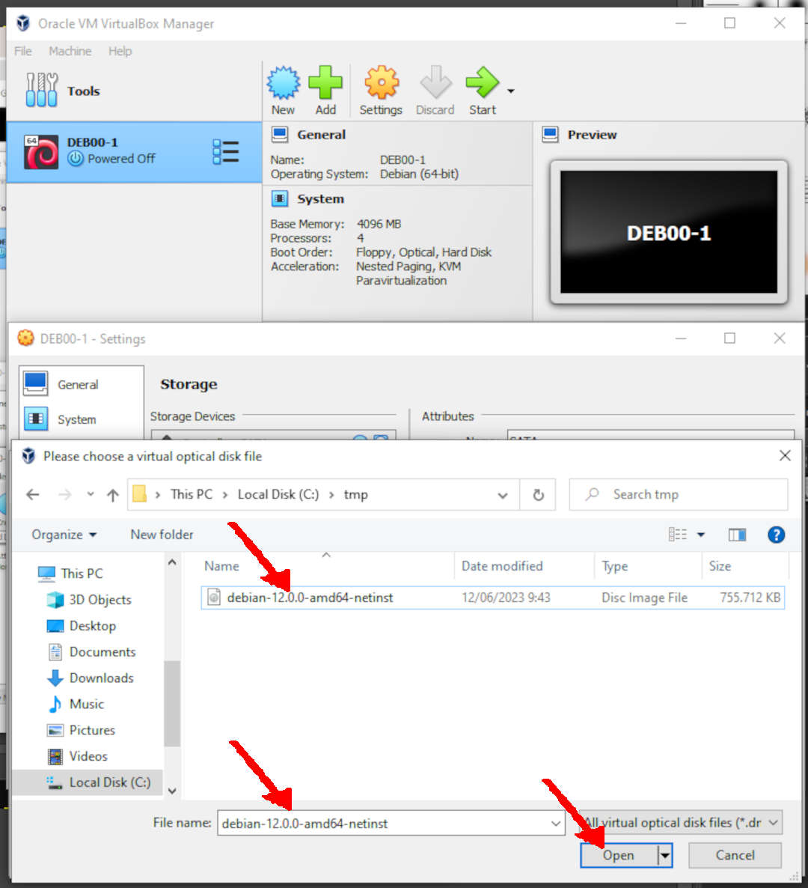
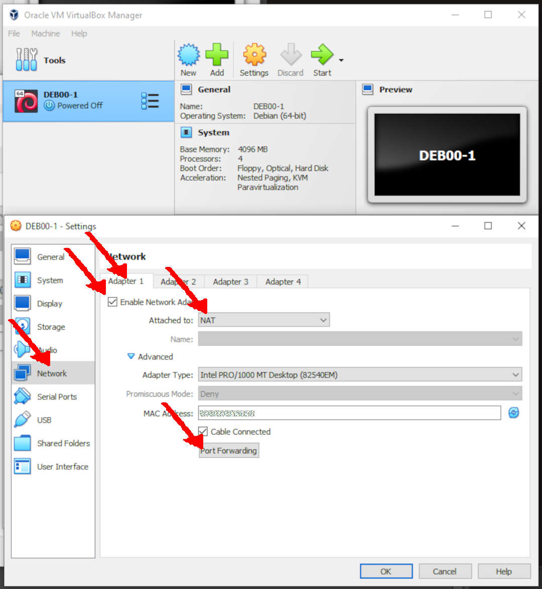
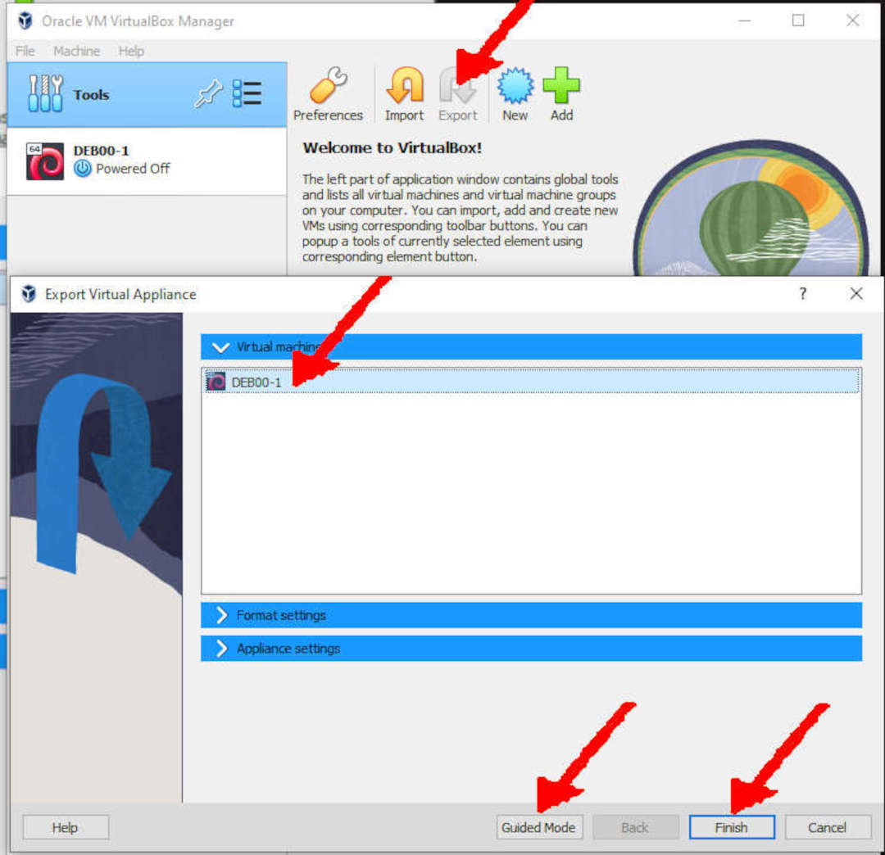

# Debian Guest Preparation

## Installing Debian Gnu/Linux

:::note

* When doing the installation, most of the options are **DEFAULT**. Possible different answers will be marked with **`ARROWS`**. 
* If you are in `Guided Mode`, switch to `Expert Mode`.
* These are just examples, the whole examples, and nothing but examples. So please help me, `GNU/Linux`! 
  
You might select other options based on your faith and religion *(i.e., kepercayaan and keyakinan masing-masing).*

:::

| Field | Param |
|---|---|
| Name | `DEB00-0`|
| Type | `Linux`|
| Version | `Debian (64 bit)` |
| Base Memory | `4096 MB`|
| Processors | `4` |
| Hard Disk |
| > Size | `24 GB`|
| > Type | `VDI`|

:::caution
## Expect the Unexpected

Sh*t sometimes happens!


:::

## Select: `New`

:::note

* When doing the installation, most of the options are **DEFAULT**. Possible different answers will be marked with **`ARROWS`**. 
* If you are in `Guided Mode`, switch to `Expert Mode`.

:::


### Virtual Machine Name and Operating Systems

:::note

* When doing the installation, most of the options are **DEFAULT**. Possible different answers will be marked with **`ARROWS`**. 
* If you are in `Guided Mode`, switch to `Expert Mode`.

:::

* Select: `Expert Mode`




| Field | Param |
|---|---|
| Name | `DEB00-0`|
| Type | `Linux`|
| Version | `Debian (64 bit)` |


### Hardware

:::note

* When doing the installation, most of the options are **DEFAULT**. Possible different answers will be marked with **`ARROWS`**. 
* If you are in `Guided Mode`, switch to `Expert Mode`.

:::

| Field | Param |
|---|---|
| Base Memory | `4096 MB`|
| Processors | `4` |

:::danger

Make sure that you don't cross the red line!

:::


### Hard Disk

Do not worry about having a 24 GB empty disk! An empty disk does not occupy much space.

| Field | Param |
|---|---|
| > Size | `24 GB`|
| > Type | `VDI`|


## Export OVA: `DEB00-0`

* Select: 
  * `Tools` -> `Export`
  * FINISH


## Rename `DEB00-0` to `DEB00-1`


* In `General`, click `Name: DEB00-0`
* Set `Name: DEB00-1`
* `OK`


## Fine Tunning


### General: Basic

| Field | Param |
|---|---|
| Name | `DEB00-0`|
| Type | `Linux`|
| Version | `Debian (64 bit)` |


### General: Advanced

| Field | Param |
|---|---|
| Shared Clipboard | `Bi-directonal`|
| Drag'n Drop | `Bi-directonal`|





### System: MotherBoard

| Field | Param |
|---|---|
| Base Memory | `4096 MB`|
| Boot Order | `Optical` -> `Hard Disk`|
| Chipset | `PIIX3` |
| TPM | `None` |
| Pointing Device | `USB Tablet` |
| Extended Feature | `Enable I/O APIC`|
|  | `Enable Hardware Clock in UTC Time`|


### System: Processor

| Field | Param |
|---|---|
| Processors | `4` |
| Execution Cap | `100%` |
| Extended Feature | `Enable PAE/NX`|

:::danger

Make sure that you don't cross the red line!

:::


### System: Acceleration

| Field | Param |
|---|---|
| Paravirtualization Interface | `Default` |
| Hardware Virtualization | `Enable Nesting Page` |


### Display: Screen

 Field | Param |
|---|---|
| Video Memory | `16 MB` |
| Monitor Count | `1` |
| Scale Factor | `150%` |
| Graphics Controller | `WMSVGA` |





### Storage: Devices: Controller: IDE

* REMOVE IDE CONTROLLER: (RIGHT CLICK)






### Storage: Devices: Controller: SATA

* Add Optical Drive


* Add ISO Disk Image File


You can download the Debian ISO file from the official Debian website at the following URL:
<https://cdimage.debian.org/debian-cd/current/amd64/iso-cd/>


:::caution
* The ISO image
  is/was `debian-12.0.0-amd64-netinst.iso`
  --- but this is subject to change.
:::



* Choose ISO Image


* Done


### AUDIO
* Audio: OFF


### Network: Adapter 1

* Enable Network Adapter
  * Attachet to: NAT
  * Advanced:
    * Adapter Type: Intel Pro/1000 MT Desktop
    * Cable Connected: Checked
    * Port Forwarding (CLICK)




### Port Forwarding Rules (SSH)

| Name   | Protocol | Host IP   | Host Port | Guest IP  | Guest Port |
|---|---|---|---|---|---|
| Rule 1 | TCP      | 127.0.0.1 | 6022      | 10.0.2.15 | 22         |


## DONE `OK`


## EXPORT: `DEB00-1`

* TOOLS (CLICK)


:::note

* When doing the installation, most of the options are **DEFAULT**. Possible different answers will be marked with **`ARROWS`**. 

:::

* Virtual Machine: `DEB00-1`



```
Path: docs/virtualbox/debian-guest-preparation
```